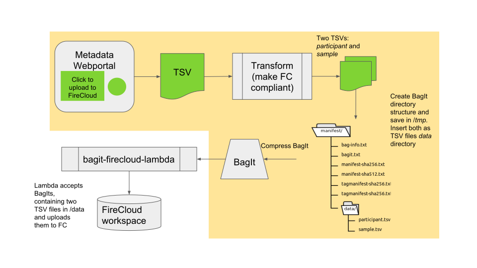

# bagit-firecloud-lambda

This  [AWS Lambda](https://aws.amazon.com/lambda/) accepts a POST with a  [BagIt](https://en.wikipedia.org/wiki/BagIt) in the request body, and uploads TSVs from the bagit to FireCloud. Once FireCloud adds an endpoint that directly accepts a BagIt, this lambda will be unnecessary.

A staging instance is currently stood up at `https://vzltaytzg4.execute-api.us-west-2.amazonaws.com/api/`.



## Using the service

```
curl -X POST --header "Authorization: Bearer <Google token>" -header "Content-type: application/octet-stream" --data @bagit.zip "https://vzltaytzg4.execute-api.us-west-2.amazonaws.com/api/exportBag?workspace=<workspace>&namespace=<namespace>" 
```

* Google token -- a Google oauth token. This is used when making the FireCloud API calls. The FireCloud API currently
requires that this token have the `https://www.googleapis.com/auth/devstorage.full_control` scope.
* bagit.zip -- A BagIt, zipped up (the included [manifest](example_BagIt/manifest) containing fake data can be zipped up and used for testing).
* workspace -- The name of the FireCloud workspace. If it does not exist, this lambda will create the workspace.
* namespace -- The name of the FireCloud namespace. In the FireCloud UI, a namespace is called a `billing project`.
The namespace must already exist in FireCloud.

## The Bag

Currently the lambda expects a BagIt containing two TSV files, `participant.tsv` and `sample.tsv`, which it  uploads in to FireCloud in that order. 

`participant.tsv` needs to contain only one column with unique records (e.g., donor UUIDs). The column header in `sample.tsv` holding the sample UUIDs needs to be `entity:sample_id`. Also, `sample.tsv` needs to have a column `participant_id` as the foreign key, which repeats the column of `participant.tsv`. See [FireCloud specifications](https://software.broadinstitute.org/firecloud/documentation/article?id=10954) for details.

## TODO

* Should also support fetch.txt in BagIt, where the TSVs are not directly in the BagIt .
* Better error handling; utils.py assumes all http invocations are successful 
* Test TSV file content (i.e., which one contains `participant` and `sample` data) so that naming of TSV files can be left to the user. 
* Finalize the response body for success
